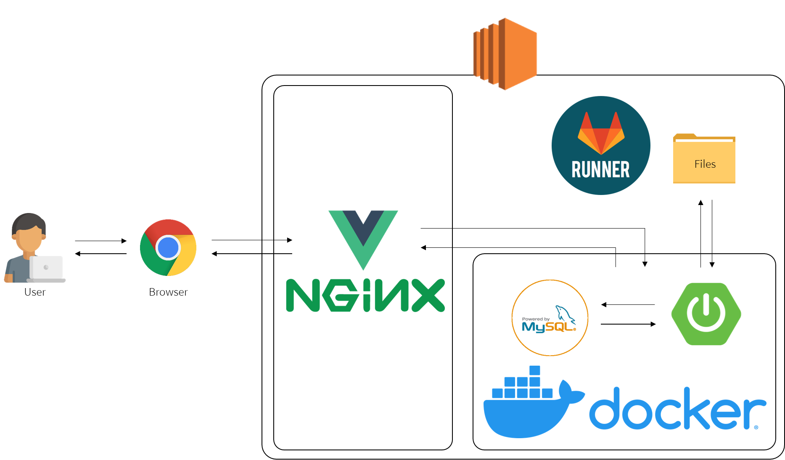

# DevIT Up! 참여형 강의 플랫폼

<br>

<br>


## Index

- [DevIT Up! 참여형 강의 플랫폼](#devit-up-참여형-강의-플랫폼)
  - [Index](#index)
  - [Team's 'DevIT' 프로젝트 참여자](#teams-devit-프로젝트-참여자)
  - [기획 및 협업을 위한 작업물](#기획-및-협업을-위한-작업물)
  - [Project structure](#project-structure)
  - [Wireframe](#wireframe)
  - [Develop tools](#develop-tools)
    - [IDE used](#ide-used)
    - [Tool/Program used](#toolprogram-used)
    - [Develop env/infra](#develop-envinfra)
    - [Cooperation](#cooperation)
    - [Library used](#library-used)
        - [backend](#backend)
        - [frontend](#frontend)
  - [Project process](#project-process)
  - [Branch strategy](#branch-strategy)
    - [[type] commit msg, issue key](#type-commit-msg-issue-key)
    - [[Detail] 규칙](#detail-규칙)
  - [Project docs](#project-docs)

<br>

<br>


## Team's 'DevIT' 프로젝트 참여자

|  학번   |  이름  | 맡은 임무                        |
| :-----: | :----: | :------------------------------- |
| 0349944 | 김명석 | Team leader<br />Project manager |
| 0346364 | 이근우 | Backend developer                |
| 0345559 | 안성민 | Frontend developer               |
| 0347064 | 강슬기 | Frontend developer               |


<br>

<br>


## 기획 및 협업을 위한 작업물

Notion으로 오세요! [DevIT Up! - 참여형 강의 플랫폼](https://www.notion.so/msnodeve/DevIT-Up-64f92628821f46478d47d57fb70f016f)


<br>

<br>


## Project structure

```
.
├── .gitignore # Git 버전 관리에서 제외할 파일 목록을 지정하는 파일
├── .gitlab-ci.yml # CI/CD 관련 Gitlab-runner 사용 파일
├── README.md
├── image # 이미지 관련 폴더
├── res # 출력물
│   └── 초기 와이어프레임
│   	├── image # 와이어프레임 이미지
│ 		└── README.md
├── backend # 백엔드 Springboot Framework
│   ├── docker # docker container mySQL 초기 세팅 폴더
│   │   ├── mysql
│   │   │   ├── initdb.sql # DB 세팅 초기 SQL
│   │   │   └── mysql.Dockerfile # mySQL Container 빌드 스크립트 파일
│   │   └── docker-compose.yml # docker image 생성 및 빌드 하기 위한 파일
│   ├── ... # gradle, build 관련 폴더 및 파일
│   ├── Dockerfile # 백엔드 자동 배포를 위한 파일
│   ├── README.md
│   ├── build.gradle # 의존성 주입
│   └── src # 소스 폴더
│       ├── main # 
│       │   ├── resources
│       │   │   ├── applicatoin.yml 프로젝트 실행전 환경 정보 세팅 파일
│       │   │   └── mappers # 각 DAO 와 연결될 SQL 쿼리 폴더
│       │   └── java
│       │       └── com
│       │           └── ssafy
│       │               └── devit
│       │                   ├── config # SpringBoot 세팅 관련
│       │                   ├── controller # Controller 관련
│       │                   ├── model # DTO 관련
│       │                   ├── repository # DAO 관련
│       │                   ├── service # Service 관련 
│       │                   └── BackendApplication.java # 스프링 부트 실행 파일
│       └── test # 테스트 관련 파일
└── frontend # 프론트엔드 Vue.js Framework
    ├── ... # vue 관련 빌드 관련 폴더 및 파일
    ├── package.json # 라이브러리 관련 파일
    ├── README.md
    ├── public # 외부에서 접근 가능한 폴더
    └── src
        ├── main.js
        ├── App.vue
        ├── util # 프로젝트에서 사용할 툴 폴더
        │   ├── http_common.js
        │   └── methods_common.js 
        ├── store # vuex에서 사용하는 공유 데이터 관리
        │   └── index.js
        ├── router # 라우팅(경로) 세팅
        │   └── index.js
        ├── plugins # vuetify 라이브러리 관련 파일
        ├── lib
        │   ├── EventBus.js # 컴포넌트 간에 이벤트 발생 시킬 때 사용
        │   ├── oauth # 소셜 로그인 라이브러리
        │   │   └── KakaoLogin.js
        │   └── videojs # 비디오 관련 라이브러리
        ├── components # 화면에 보여지는 컴포넌트 관리
        │   ├── user # 사용자 관련
        │   ├── myactivity # 마이페이지 관련
        │   ├── lecture # 강의 관련
        │   ├── common # 메인 화면프레임 구성 관련
        │   ├── board # 게시판 관련
        └── asset # 로고 및 이미지 관련

```

<br><br>


## Wireframe


<br>

<br>


## Develop tools

### IDE used

- [STS(Srping Tool Suite 4](https://spring.io/tools)_v4.7.0.RELEASE
- [VScode](https://code.visualstudio.com/)_v1.47.3


### Tool/Program used

- [MySQL Wrokbench](https://www.mysql.com/products/workbench/)_v8.0.20
- [Typora](https://typora.io/)_v0.9.93


### Develop env/infra

- Windows10
- AWS EC2(Ubuntu 18.04.4 LTS)
- [Docker](https://www.docker.com/)_v2.3.0.4(46911)
- [Docker-Compose](https://docs.docker.com/compose/)
- [Gitlab-runner](https://docs.gitlab.com/runner/install/)


### Cooperation

- [Notion](https://www.notion.so/?utm_source=google&utm_campaign=brand_alpha&utm_content=kr&utm_term=notion&gclid=CjwKCAjwps75BRAcEiwAEiACMVWDOmfXiknyZ8fM5R2Mz9RPhteMAG_we-lVp-VPGqx9rgqrsglEFxoC9d8QAvD_BwE)
- [Gitlab](https://about.gitlab.com/)
- [Goormide](https://ide.goorm.io/)
- [Webex](https://www.webex.com/ko/index.html)
- [Discord](https://discord.com/new)


### Library used

##### backend

- [swagger2](https://www.baeldung.com/swagger-2-documentation-for-spring-rest-api)_v2.9.2
- [spring security](https://spring.io/projects/spring-security)
- [spring mail service](https://www.baeldung.com/spring-email)
- [spring mybatis](https://mvnrepository.com/artifact/org.mybatis/mybatis-spring)_v1.3.2
- [mysql, jdbc](https://spring.io/guides/gs/accessing-data-mysql/)


##### frontend

- [axios](https://joshua1988.github.io/vue-camp/vue/axios.html)_v0.19.2
- [vue](https://kr.vuejs.org/v2/guide/index.html)_v2.6.11
- [vue-moment](https://www.npmjs.com/package/vue-moment)_v4.1.0
- [vue-router](https://router.vuejs.org/kr/guide/)_v3.2.0
- [vuedraggable](https://www.npmjs.com/package/vuedraggable)_v2.24.0
- [vuetify](https://vuetifyjs.com/ko/)_v2.3.4
- [vuex](https://vuex.vuejs.org/kr/)_v3.4.0
- [vue videojs](https://jsfiddle.net/amosgwa/avyto22v/)
- [kakao login api](https://developers.kakao.com/docs/latest/ko/kakaologin/js)
- [jQuery](https://jquery.com/)
- [fontawesome](https://fontawesome.com/)


<br><br>


## Project process




<br><br>


## Branch strategy

| 브랜치 이름         | 목적                            | 비고 |
| ------------------- | ------------------------------- | ---- |
| master              | 배포                            |      |
| develop             | front, back 각 브랜치 기능 병합 |      |
| feature/[기능 이름] | 각 기능 개발 브랜치             |      |
| release             | 배포 하기 전 브랜치             |      |
| fix                 | 배포한 제품 버그 발견시 버그 킬 |      |

### [type] commit msg, issue key

> - feature : 새로운 기능 관련해서 작업한 내용을 적을 때 사용
> - fix : 버그를 수정했을 때 사용
> - doc : 문서 README.md를 수정했을 때 사용
> - test : 테스트코드, 아무 테스트 작업했을 때 사용
> - cicd : 배포관련이나 빌드 관련 작업 했을 때 사용
> - style : 코드 포맷팅, 세미콜론 누락, 코드 변경이 없는 경우 사용
> - refactor: 코드 리팩토링 할때 사용

### [Detail] 규칙

> - 제목은 50자를 넘기지 말것
> - 대문자로 작성
> - 마침표를 붙이지 말것
> - 과거 시제 사용 금지 (그냥 현재 시제 사용할 것)


## Project docs

**[Frontend docs](./frontend)**

**[Backend docs](./backend)**

